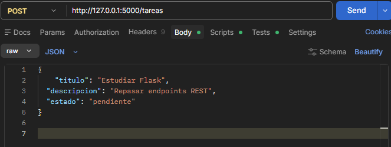
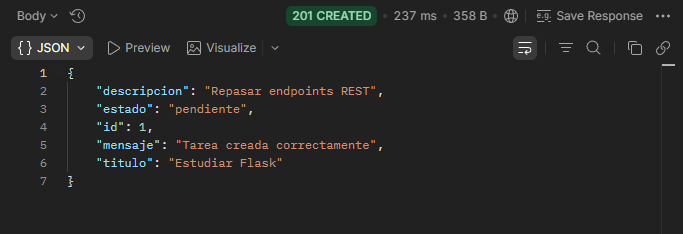
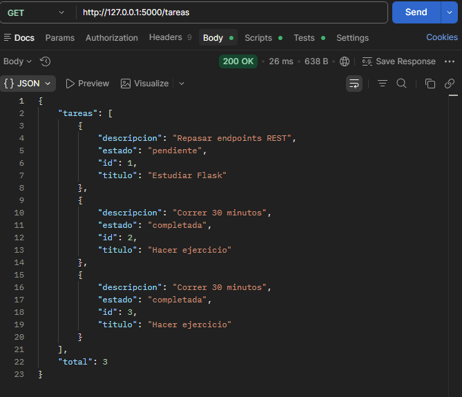
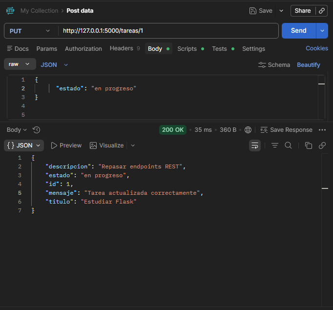
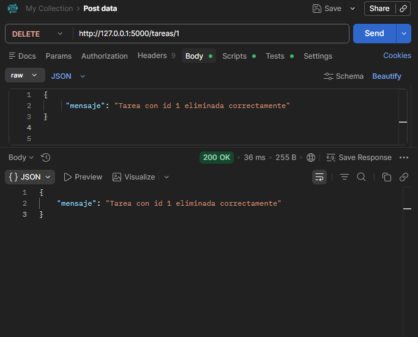

# API REST CRUD de Tareas con Flask y MySQL 🐍🗄️

API para administrar tareas personales con operaciones completas de creación,
consulta, actualización y eliminación, desarrollada con Python, Flask y MySQL.

---
# Ángel Gabriel Rojas Hernánadez
---

## Requisitos previos

- Python 3.8 o superior
- MySQL instalado y corriendo
- pip

---

## Instalación y configuración

**1. Clona el repositorio**
```bash
git clone https://github.com/tu-usuario/ejercicio4-tareas.git
cd ejercicio4-tareas
```

**2. Crea y activa el entorno virtual**
```bash
py -m venv venv
venv\Scripts\activate        # Windows
source venv/bin/activate     # Mac / Linux
```

**3. Instala las dependencias**
```bash
pip install flask flask-cors mysql-connector-python
```

**4. Crea la base de datos en MySQL**

Abre MySQL Workbench y ejecuta:
```sql
CREATE DATABASE tareas_db;

USE tareas_db;

CREATE TABLE tareas (
    id          INT AUTO_INCREMENT PRIMARY KEY,
    titulo      VARCHAR(100)  NOT NULL,
    descripcion VARCHAR(255),
    estado      VARCHAR(20)   DEFAULT 'pendiente'
);
```

**5. Configura tu conexión**

Abre `ejercicio4.py` y edita el bloque `DB_CONFIG` con tus datos:
```python
DB_CONFIG = {
    'host':     'localhost',
    'user':     'root',
    'password': 'tu_contraseña',
    'database': 'tareas_db'
}
```

**6. Ejecuta la API**
```bash
python ejercicio4.py
```
El servidor corre en `http://127.0.0.1:5000`

---

## Endpoints

### POST /tareas — Crear una tarea

**URL**
```
POST http://127.0.0.1:5000/tareas
```

**Body (JSON)**
```json
{
  "titulo": "Estudiar Flask",
  "descripcion": "Repasar endpoints REST",
  "estado": "pendiente"
}
```

**Respuesta exitosa (201)**
```json
{
  "mensaje": "Tarea creada correctamente",
  "id": 1,
  "titulo": "Estudiar Flask",
  "descripcion": "Repasar endpoints REST",
  "estado": "pendiente"
}
```

**Capturas de pantalla**

<!-- Agrega aquí tu captura del POST en Postman -->


<!-- Agrega aquí tu captura de la respuesta -->


---

### GET /tareas — Consultar todas las tareas

**URL**
```
GET http://127.0.0.1:5000/tareas
```

No requiere body.

**Respuesta exitosa (200)**
```json
{
  "total": 2,
  "tareas": [
    {
      "id": 1,
      "titulo": "Estudiar Flask",
      "descripcion": "Repasar endpoints REST",
      "estado": "pendiente"
    },
    {
      "id": 2,
      "titulo": "Hacer ejercicio",
      "descripcion": "Correr 30 minutos",
      "estado": "completada"
    }
  ]
}
```

**Capturas de pantalla**

<!-- Agrega aquí tu captura de la respuesta -->


---

### PUT /tareas/\<id\> — Actualizar una tarea

**URL**
```
PUT http://127.0.0.1:5000/tareas/1
```

**Body (JSON)** — puedes enviar solo los campos que quieras actualizar:
```json
{
  "estado": "en progreso"
}
```

**Respuesta exitosa (200)**
```json
{
  "mensaje": "Tarea actualizada correctamente",
  "id": 1,
  "titulo": "Estudiar Flask",
  "descripcion": "Repasar endpoints REST",
  "estado": "en progreso"
}
```

**Capturas de pantalla**

<!-- Agrega aquí tu captura de la respuesta -->


---

### DELETE /tareas/\<id\> — Eliminar una tarea

**URL**
```
DELETE http://127.0.0.1:5000/tareas/1
```

No requiere body.

**Respuesta exitosa (200)**
```json
{
  "mensaje": "Tarea con id 1 eliminada correctamente"
}
```

**Capturas de pantalla**

<!-- Agrega aquí tu captura de la respuesta -->


---

## Estados válidos

| Estado | Descripción |
|---|---|
| `pendiente` | Tarea recién creada, sin iniciar |
| `en progreso` | Tarea en curso |
| `completada` | Tarea finalizada |

---

## Manejo de errores

| Situación | Código | Mensaje |
|---|---|---|
| No se envía body | 400 | `"No se recibieron datos"` |
| Falta el título | 400 | `"Falta el campo titulo"` |
| Estado no válido | 400 | `"Estado no válido. Use: pendiente, en progreso, completada"` |
| ID no existe | 404 | `"No existe una tarea con id X"` |
| Error de base de datos | 500 | Mensaje del error |

---

## Estructura del proyecto

```
ejercicio4-tareas/
├── venv/
├── ejercicio4.py
└── README.md
```

---

## Resumen de endpoints

| Método | Endpoint | Descripción |
|---|---|---|
| POST | `/tareas` | Crear una nueva tarea |
| GET | `/tareas` | Consultar todas las tareas |
| PUT | `/tareas/<id>` | Actualizar una tarea por ID |
| DELETE | `/tareas/<id>` | Eliminar una tarea por ID |

---

## Comandos para retomar el proyecto

```bash
cd ejercicio4-tareas
venv\Scripts\activate
python ejercicio4.py
```
